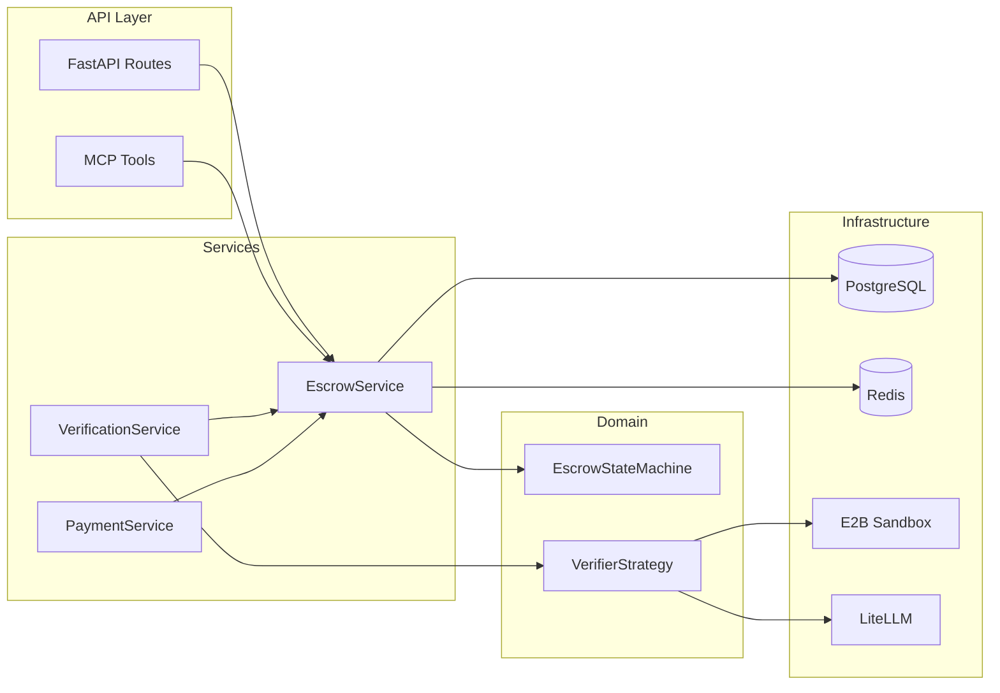

# Agentic Clearinghouse — Full Documentation (v1.0 and v1.1 Roadmap)

**Trust Code, Not Agents.**

---

## Table of Contents

1. [Overview and What Has Been Done](#1-overview-and-what-has-been-done)
2. [Architecture and Data Flow](#2-architecture-and-data-flow)
3. [Tools and Entry Points](#3-tools-and-entry-points)
4. [Test Cases and How They Work](#4-test-cases-and-how-they-work)
5. [Current Loose Ends](#5-current-loose-ends)
6. [v1.1 Roadmap — Expansion and Tying Loose Ends](#6-v11-roadmap--expansion-and-tying-loose-ends)
7. [Tech and Implementation Recommendations](#7-tech-and-implementation-recommendations)

---

## 1. Overview and What Has Been Done

**Product**: The Agentic Clearinghouse is an escrow and verification protocol for AI agents. Buyers create funded escrow contracts; workers accept, submit work, and get paid only after verification passes. Philosophy: *Trust Code, Not Agents.*

**Implemented to date**:

- **Scaffolding**: Project layout (Hexagonal-style), [pyproject.toml](../pyproject.toml) with uv, [config](../src/agentic_clearinghouse/config.py) via pydantic-settings, [ORM models](../src/agentic_clearinghouse/infrastructure/database/orm_models.py) (escrow_contracts, work_submissions, escrow_events), async engine and repos, Redis client with idempotency helpers, [schemas](../src/agentic_clearinghouse/schemas/escrow.py), [middleware](../src/agentic_clearinghouse/api/middleware.py) (request ID, error handling, CORS), health route.
- **Domain**: [Enums](../src/agentic_clearinghouse/domain/enums.py) (EscrowStatus, EventType, VerifierType), [exceptions](../src/agentic_clearinghouse/domain/exceptions.py), [state machine](../src/agentic_clearinghouse/domain/state_machine.py) (python-statemachine guard), [verifier protocol](../src/agentic_clearinghouse/domain/verifier_protocol.py) (VerificationRequest, VerificationResult, VerifierStrategy).
- **Verifiers**: [SchemaVerifier](../src/agentic_clearinghouse/verifiers/schema_validator.py) (JSON Schema), [SemanticVerifier](../src/agentic_clearinghouse/verifiers/semantic.py) (LiteLLM judge), [CodeExecutionVerifier](../src/agentic_clearinghouse/verifiers/code_execution.py) (E2B sandbox), [MockVerifier](../src/agentic_clearinghouse/verifiers/__init__.py) (dry-run), [VerifierFactory](../src/agentic_clearinghouse/verifiers/__init__.py) (dispatch by type).
- **Services**: [EscrowService](../src/agentic_clearinghouse/services/escrow_service.py) (create, fund, accept, submit, start_verification, record pass/fail, raise_dispute, get_contract/status/events), [VerificationService](../src/agentic_clearinghouse/services/verification_service.py) (submit -> verify -> record), [PaymentService](../src/agentic_clearinghouse/services/payment_service.py) (simulate + stub for real AgentKit).
- **Orchestration**: [run_escrow_workflow](../src/agentic_clearinghouse/orchestration/escrow_graph.py) (submit -> verify -> settle or retry/fail; single async function, no LangGraph graph yet).
- **API**: REST [escrow routes](../src/agentic_clearinghouse/api/routes/escrow.py) (create, fund, accept, submit, dispute, get, status, events), [MCP tools](../src/agentic_clearinghouse/mcp_server/tools.py) (create_escrow, fund_escrow, accept_contract, submit_work, check_status, raise_dispute) mounted at `/mcp`, [deps](../src/agentic_clearinghouse/api/deps.py) (session, repos, Redis, settings).
- **Simulation**: [simulation.py](../simulation.py) with BuyerBot/WorkerBot, three scenarios (happy path, fail-and-retry, malicious worker), `--sqlite`, `--dry-run` (mock verifiers), `--scenario N`.

---

## 2. Architecture and Data Flow

**State machine (summary)**: CREATED -> FUNDED -> IN_PROGRESS -> SUBMITTED -> VERIFYING -> COMPLETED or (IN_PROGRESS retry / FAILED). DISPUTED from FUNDED or IN_PROGRESS; DISPUTED -> COMPLETED or FAILED via dispute resolution (not automated).

---

## 3. Tools and Entry Points

| Tool / Entry point | Type | Purpose |
| ------------------ | ---------------------------- | -------------------------------------------------------------------------------------------------------------------------------------------------------------------- |
| **REST API** | HTTP | Create/fund/accept/submit/dispute and read contract/status/events. Base path `/api/v1/escrow`. Docs at `/docs` in development. |
| **MCP server** | Protocol (mounted at `/mcp`) | Same operations as REST, for agent-to-clearinghouse calls. Tools: `create_escrow`, `fund_escrow`, `accept_contract`, `submit_work`, `check_status`, `raise_dispute`. |
| **Simulation** | CLI | `uv run python simulation.py [--sqlite] [--dry-run] [--scenario 1\|2\|3]`. Runs BuyerBot/WorkerBot flows; dry-run uses MockVerifier (no E2B/LLM). |
| **Uvicorn** | Server | `uv run uvicorn agentic_clearinghouse.main:app --reload --host 0.0.0.0 --port 8000`. |

**Key config (env)**: DATABASE_URL, REDIS_URL, E2B_API_KEY, GEMINI_API_KEY (or OPENAI), LITELLM_MODEL, CDP_* for payments. See [.env.example](../.env.example).

---

## 4. Test Cases and How They Work

**Location**: All under [tests/](../tests/). Pytest with asyncio; markers: `integration` for tests that call real E2B/Gemini (skipped with `-m "not integration"`).

| File | What it tests | How |
| ------------------------------------------- | ------------------------------------- | ---------------------------------------------------------------------------------------------------------------------------------------------------------------------------------------------------------------------- |
| **test_domain/test_enums.py** | EscrowStatus, EventType, VerifierType | Asserts enum members exist and are string enums. |
| **test_domain/test_state_machine.py** | EscrowStateMachine | Instantiates machine at a status, fires events (e.g. worker_accepts, verification_passed), asserts new state; tests illegal transitions and validate_transition(). |
| **test_verifiers/test_schema_validator.py** | SchemaVerifier | Builds VerificationRequest with payload + requirements_schema; asserts is_valid and details for valid JSON, missing/wrong types, malformed JSON, missing schema. |
| **test_verifiers/test_semantic.py** | SemanticVerifier | Mocks `litellm.acompletion` to return fixed strings; tests verdict parsing (TRUE/FALSE), score clamping, malformed/missing criteria, API failure. |
| **test_verifiers/test_code_execution.py** | CodeExecutionVerifier | Mocks E2B sandbox (AsyncSandbox, run_code) to return (stdout, stderr, exit_code); tests pass on exit 0 and optional expected_output, fail on wrong exit/output/timeout/sandbox error; missing API key; malicious code. |
| **test_verifiers/test_factory.py** | VerifierFactory | create() for type code_execution, semantic, schema, mock; unknown/missing type raises; get_supported_types() returns 4 types. |
| **test_verifiers/test_integration.py** | Real E2B and Gemini | @pytest.mark.integration; skipped if E2B_API_KEY or GEMINI_API_KEY missing. E2B: Fibonacci, syntax error, malicious code. Gemini: semantic judge (e.g. tweet, poem). |

**Running**: `uv run pytest tests/ -v` (all); `uv run pytest tests/ -m "not integration" -v` (unit only); `uv run pytest tests/test_verifiers/test_integration.py -v -s` (integration with keys set).

---

## 5. Current Loose Ends

- **Idempotency not wired**: [CreateEscrowRequest](../src/agentic_clearinghouse/schemas/escrow.py) has `idempotency_key` and [redis_client](../src/agentic_clearinghouse/infrastructure/redis_client.py) has `check_idempotency`/`set_idempotency`, but no route or MCP tool checks/sets it on create. Duplicate creates are possible.
- **Payments are simulation-only in flow**: [PaymentService](../src/agentic_clearinghouse/services/payment_service.py) has `simulate=True` by default. Real funding path raises `NotImplementedError`; real settlement is stubbed with AgentKit imports but not used in the main workflow. [escrow_graph](../src/agentic_clearinghouse/orchestration/escrow_graph.py) uses `PaymentService(simulate=True)`.
- **Settlement tx hash not persisted in workflow**: In [escrow_graph](../src/agentic_clearinghouse/orchestration/escrow_graph.py), `contract.settlement_tx_hash = tx_hash` is set on the ORM object; persistence depends on the caller committing the same session. MCP and REST submit both commit after the workflow, so it should persist; worth adding an explicit flush or a dedicated repo method and a test to be sure.
- **Dispute resolution is manual**: Contract can move to DISPUTED, but `dispute_resolved_for_worker` / `dispute_resolved_for_buyer` are only in the state machine—no API or MCP tool to resolve a dispute (no arbitrator flow or admin endpoint).
- **No auth on REST or MCP**: No API keys or JWT; any client can call any endpoint. Fine for local dev, not for a shared or production v1.1.
- **MCP session handling**: MCP tools use `_get_session()` and `async with session` then `commit()`; if a tool fails after partial work, rollback behavior should be explicit (e.g. try/except rollback).
- **VerificationService "no submissions" path**: Uses a placeholder submission_id when there are no submissions ([verification_service.py](../src/agentic_clearinghouse/services/verification_service.py)); contract is still driven to failed state but the placeholder ID is not a real row.
- **SQLite only in simulation**: JSONB compatibility for SQLite is patched in simulation.py for in-memory runs; production and CI assume PostgreSQL. Alembic and ORM are PostgreSQL-oriented (e.g. JSONB).

---

## 6. v1.1 Roadmap — Expansion and Tying Loose Ends

**Suggested scope for "next level" without overbuilding**:

1. **Idempotency**: In create_escrow (REST and MCP), if `idempotency_key` is present: call `check_idempotency(key)`; if true return 409 and DuplicateOperationError; after successful create call `set_idempotency(key, str(contract.id))`. Optionally add idempotency for fund/submit (e.g. fund by contract_id + idempotency key).
2. **Dispute resolution API**: Add POST `/api/v1/escrow/{id}/dispute/resolve` and MCP tool `resolve_dispute(contract_id, resolution: "worker" | "buyer", resolved_by)`. In service layer, fire `dispute_resolved_for_worker` or `dispute_resolved_for_buyer`, update status, record event. Keep resolution authority simple (e.g. trusted backend or same wallet that raised).
3. **Settlement persistence**: Add `EscrowRepository.update_settlement_tx(contract_id, tx_hash)` and call it from the workflow after transfer_to_worker; or ensure single transaction and one commit so current in-memory assignment is committed. Add a test that creates a contract, runs workflow to COMPLETED, and asserts contract.settlement_tx_hash in DB.
4. **Auth (minimal)**: API key auth for REST (e.g. X-API-Key header, validate against env or Redis). Optional: same key for MCP or a separate MCP key. No need for per-user JWT in v1.1.
5. **MCP error and transaction handling**: In each MCP tool, wrap session usage in try/except; on exception call `session.rollback()` then re-raise. Ensures no partial commits.
6. **Config-driven payment mode**: Add `PAYMENT_SIMULATE=true|false` (or derive from APP_ENV). When false, PaymentService(simulate=False) and implement or complete real funding verification and settlement (AgentKit) for Base Sepolia; keep E2B/LLM as-is.
7. **Docs and README**: Add link to this DOCUMENTATION.md from README; document env vars and optional idempotency_key in API docs.

---

## 7. Tech and Implementation Recommendations

- **LangGraph**: The "orchestration" is currently one async function, not a LangGraph graph. For v1.1, either (a) keep it as-is and rename to "workflow" not "graph," or (b) introduce a small LangGraph (e.g. nodes: submit, verify, settle, fail) with conditional edges so future branches (e.g. dispute, timeout) are explicit. Recommendation: (a) unless you need to add more branching or human-in-the-loop.
- **Redis**: Used for idempotency only today. Rate limiting and caching are mentioned in [redis_client](../src/agentic_clearinghouse/infrastructure/redis_client.py) but not implemented. v1.1: add rate limiting (e.g. per IP or per wallet) on create_escrow and submit_work to avoid abuse.
- **python-statemachine vs LangGraph**: Domain guard (python-statemachine) is the right place for "can this transition happen?"; orchestration (workflow) is "what do we do next?". Keep both; don't duplicate transition rules in LangGraph.
- **LiteLLM**: Already model-agnostic (Gemini, OpenAI). Consider adding a small retry with backoff (tenacity is already used in SemanticVerifier) and a circuit breaker if Gemini/OpenAI are down so the verifier returns a clear "LLM unavailable" result instead of long timeouts.
- **E2B**: Cold start cost per run is acceptable for MVP. If v1.1 sees high throughput, consider a "warm pool" or batch submissions to amortize sandbox creation (only if metrics justify it).
- **Alembic**: Migrations exist; ensure all schema changes (e.g. new columns for dispute resolution) go through Alembic in v1.1 rather than only create_all in dev.
- **Testing**: Add a few API-level tests (TestClient) for POST create, GET status, and optionally submit (with mock verifier) so REST contract is guaranteed. Integration tests for E2B/Gemini remain optional and marker-gated.
